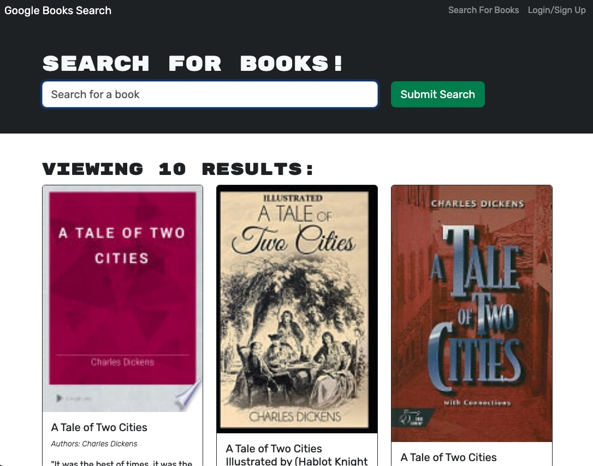

# bookSearch

## Description 

This application uses an Apollo Server and GraphQL API to allow users to search for books and save them to a list of books. Users can search for books without signing in, but must log in in order to save books. Users can also remove books from their saved books lists. 

## Screenshot

## Deployed Application
You can find the deployed website [here](https://booksearch-84sq.onrender.com/)